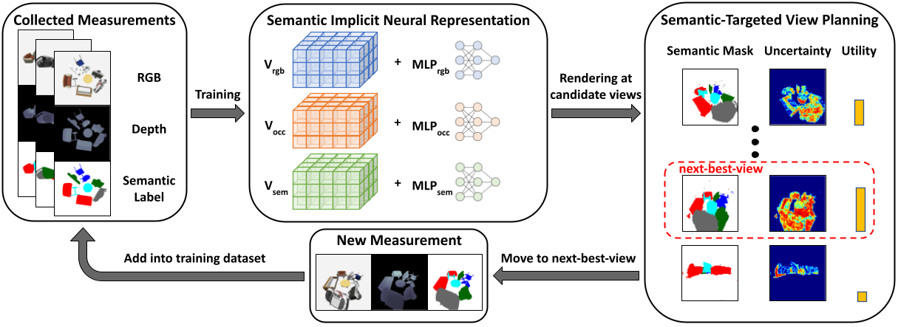
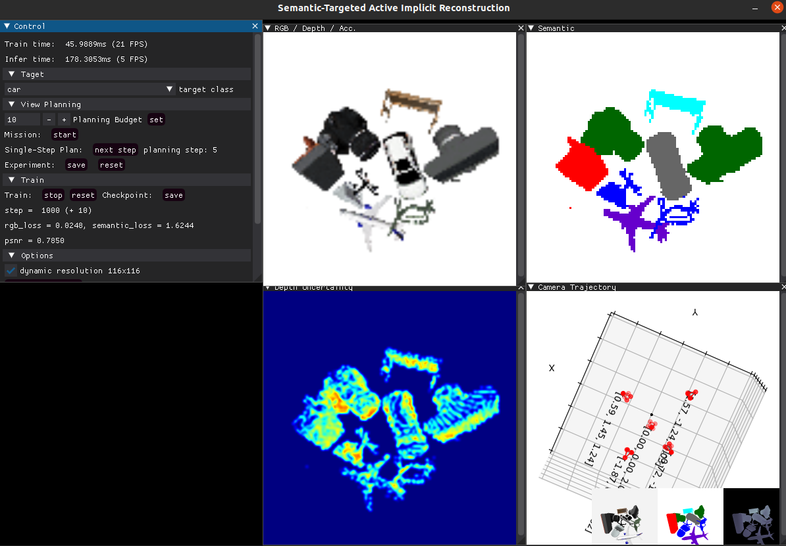

# STAIR: Semantic-Targeted Active Implicit Reconstruction
Liren Jin, Haofei Kuang, Yue Pan, Cyrill Stachniss, Marija Popović<br>
University of Bonn

This repository contains the implementation of our paper "STAIR: Semantic-Targeted Active Implicit Reconstruction" accepted to IROS 2024.

```commandline
@INPROCEEDINGS{jin2024stair,
      title={STAIR: Semantic-Targeted Active Implicit Reconstruction}, 
      booktitle={2024 IEEE/RSJ International Conference on Intelligent Robots and Systems (IROS)}, 
      author={Jin, Liren and Kuang, Haofei and Pan, Yue and Stachniss, Cyrill and Popović, Marija},
      year={2024}}
```
## Abstract
Many autonomous robotic applications require object-level understanding when deployed. Actively reconstructing objects of interest, i.e. objects with specific semantic meanings, is therefore relevant for a robot to perform downstream tasks in an initially unknown environment. In this work, we propose a novel framework for semantic-targeted active reconstruction using posed RGB-D measurements and 2D semantic labels as input. The key components of our framework are a semantic implicit neural representation and a compatible planning utility function based on semantic rendering and uncertainty estimation, enabling adaptive view planning to target objects of interest. Our planning approach achieves better reconstruction performance in terms of mesh and novel view rendering quality compared to implicit reconstruction baselines that do not consider semantics for view planning. Our framework further outperforms a state-of-the-art semantic-targeted active reconstruction pipeline based on explicit maps, justifying our choice of utilising implicit neural representations to tackle semantic-targeted active reconstruction problems.

An overview of our STAIR framework:



## Setup
We use ignite-gazebo and shapenet models for simulation purpose: 
1. Install the simulator
```
git clone git@github.com:liren-jin/shapenet_simulator.git
cd shapenet_simulator
docker build . -t shapenet-simulator:v0
```
2. Install  Nvidia runtime support from [here](https://github.com/NVIDIA/nvidia-container-toolkit). 
3. Download the shapenet models used in our experiment [here](https://drive.google.com/file/d/14M0Q6YNBfL0f_ACbrxOcMvuGTHBLR66r/view?usp=sharing) and extract them to `shapenet_simulator/src/simulator/models`.
4. Download the scene data [here](https://drive.google.com/file/d/1xtQjAJ_dBdpFobOzMEAXPNRldPaCOlip/view?usp=sharing) and extract them to `shapenet_simulator/src/simulator/scenes`.
(Optional) for more advanced usages, e.g, generate new scenes and test data, please follow the [instruction](https://github.com/liren-jin/shapenet_simulator).

5. Set up STAIR repo:
```commandline
git clone https://github.com/dmar-bonn/stair
cd stair
conda env create -f environment.yaml
conda activate arsenal
python setup.py build_ext --inplace
```
6. Copy the extracted scene data (scene1, scene2 ....) in step 4 also to `stair/test_data` for evaluation purpose. 

## Basic Usage
In one terminal, in the shapenet_simulator folder, start the simulator:
```
xhost +local:docker
make 
make enter
cd <scene_id>
ign gazebo -r scene.sdf
```

In anothor ternimal, in stair folder, start active reconstruction:
```
conda activate stair
```
(Optional) If you do not have ros1 installed in your local machine, we also added ros support in conda environment. However, in order to communicate with roscore running in docker container, you have to set environment variable:
```commandline
export ROS_MASTER_URI=http://localhost:11311
``` 
Start plannning experiment:
```commandline
python plan.py --config <planner type> implicit --target_class_id <class id> --gui
```

Available values for the command line flag:
| Flag  | Available value    |
|----------------------------|---------------|
| planner type| uncertainty_target, uncertainty_all, coverage, max_distance, uniform|
| class id    | 1: car, 2: chair, 3: table, 4: sofa, 5: airplane, 6: camera|

Note: you can also choose target semantic classes in GUI.


A screenshot of GUI:



Click "next step" to move to the next view point based on the selected planner type. You should see the camera move in the shapenet simulator and updated camera trajectory in GUI as well. After collecting several images, you can start nerf training by clicking "start".


## Experiments and Evaluation
```
python plan.py --config <planner type> implicit  --exp_name <experiment name>/<scene id>  --target_class_id <target id> --gui
python eval_nerf.py --test_path test_data/<scene id> --exp_path experiment/<experiment name>/<scene id>/<planner type>
python eval_mesh.py --test_path test_data/<scene id> --exp_path experiment/<experiment name>/<scene id>/<planner type>
```
where `<experiment name>` is the name defined by user, e.g., experiment1; `<scene id>` is the scene name for the experiment, e.g., scene1.

One example for active reconstruction results can be acquired by running:
```
./run_example.sh
```

## Acknowledgements
Parts of the code are based on [DirectVoxGO](https://github.com/sunset1995/DirectVoxGO) and [torch-ngp](https://github.com/ashawkey/torch-ngp). Thanks to the authors for their awesome works!

## Maintainer
Liren Jin, ljin@uni-bonn.de


## Project Funding
This work has been fully funded by the Deutsche Forschungsgemeinschaft (DFG, German Research Foundation) under Germany’s Excellence Strategy, EXC-2070 – 390732324 (PhenoRob). All authors are with the Institute of Geodesy and Geoinformation, University of Bonn.